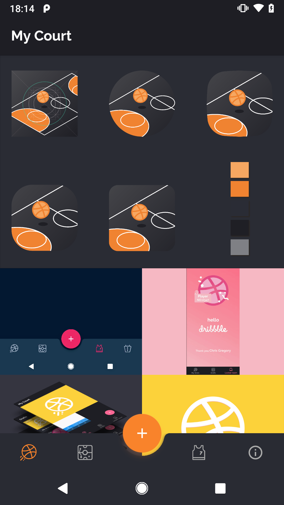
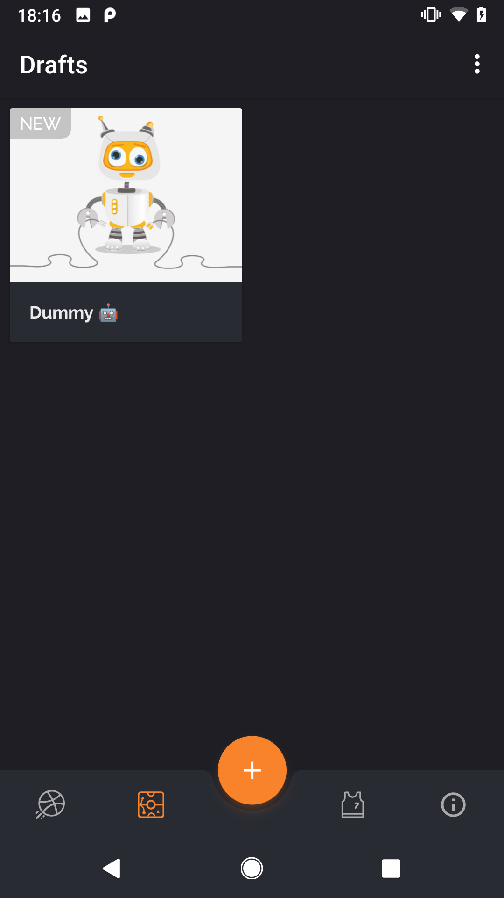
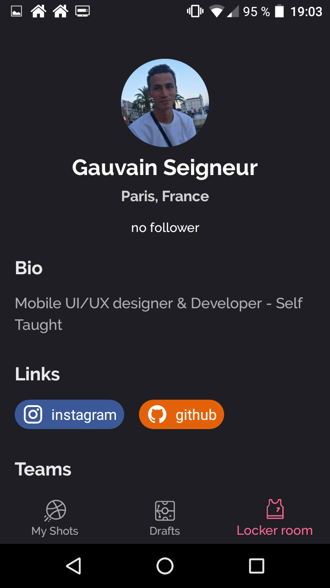

# My Court
A mobile application which uses Dribbble API V2. It focuses on Prospect, Players and pros. 
It is based on MVP pattern, Dependency injection, RXJava, Retrofit, Architecture components. 

</img>
</img>
</img>

## Features
* Fetch your shots in a recyclerView (endless scroll)
* See details of each shots
* see your account
* Create a shot and publish it (Image picker and cropping)
* Edit your published shots
* Save in drafts your current work

## State
Not stable yet.

## Todo
* Convert to Kotlin
* Future : Manage pros, Manage attachments

## Licence
```
Copyright 2018 Gauvain Seigneur

Licensed under the Apache License, Version 2.0 (the "License");
you may not use this file except in compliance with the License.
You may obtain a copy of the License at

   http://www.apache.org/licenses/LICENSE-2.0

Unless required by applicable law or agreed to in writing, software
distributed under the License is distributed on an "AS IS" BASIS,
WITHOUT WARRANTIES OR CONDITIONS OF ANY KIND, either express or implied.
See the License for the specific language governing permissions and
limitations under the License.
```